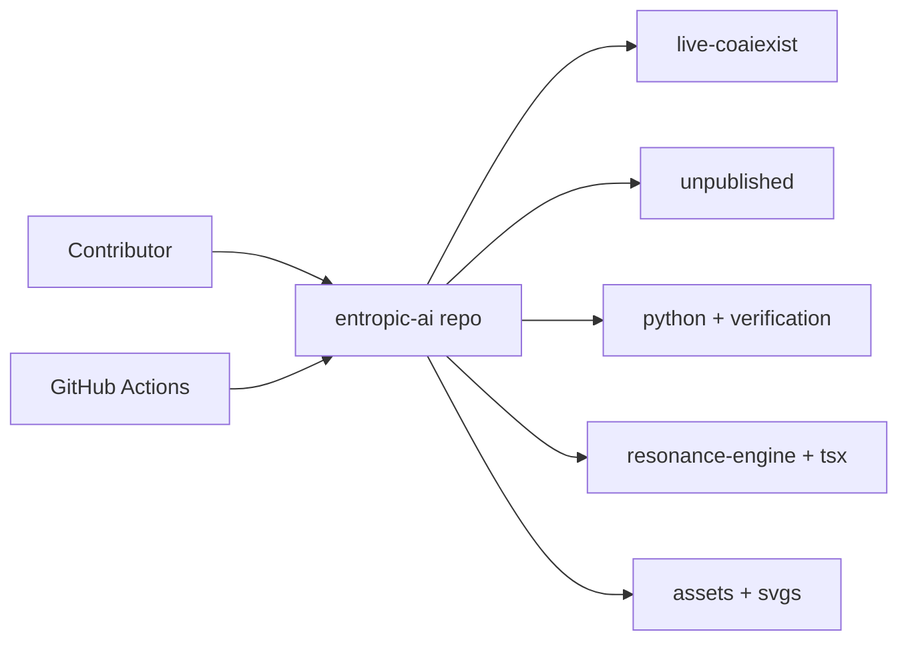
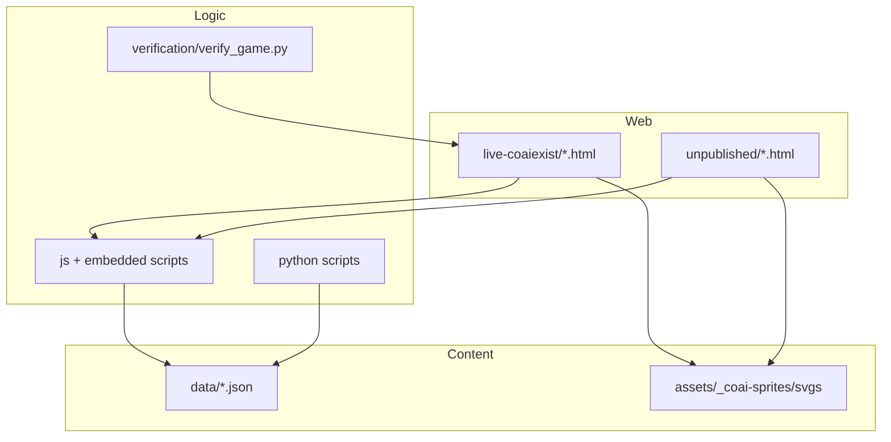
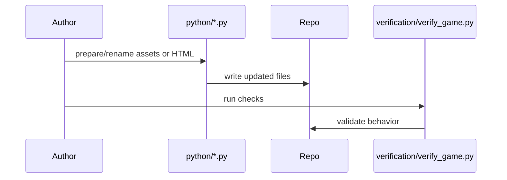
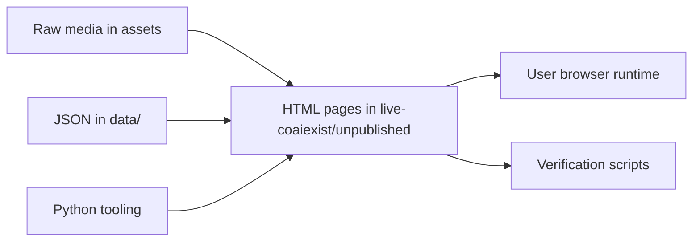
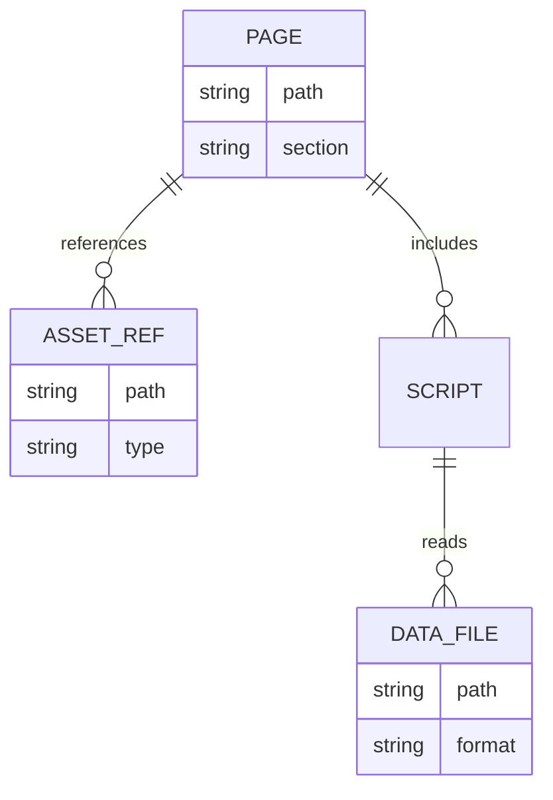

# Repo Visualization Starter Pack

## Scope map (top-level areas)
- `live-coaiexist/`: published web experiences and themed sub-sites.
- `unpublished/`: experiments, drafts, and archived variants.
- `python/` + `verification/`: automation and validation scripts.
- `resonance-engine-(techater-protocol)/` + `tsx/`: typed app components/services.
- `assets/` + `_coai-sprites/` + `svgs/`: large media and design libraries.
- `.github/workflows/`: CI automation entrypoints.

## Recommended “first 12” diagrams to build now
1. System context diagram
2. Component diagram
3. Deployment diagram
4. Package diagram
5. Use case diagram
6. Sequence diagram
7. Activity diagram
8. State diagram
9. Data flow diagram
10. Entity-relationship diagram
11. Gantt chart
12. Sankey diagram

## Mermaid templates

### 1) System context diagram

### 2) Component diagram

### 3) Sequence diagram (content update)

### 4) Data flow diagram

### 5) ERD (lightweight)

